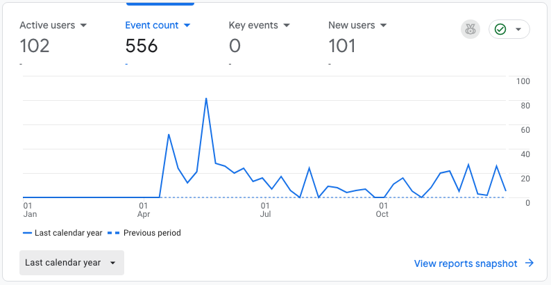

# Portfolio Website

This is a personal portfolio website built to showcase my experience, projects, and interests as a software engineer. The site is designed to be fast, responsive, and data-driven, with content managed through a headless CMS and deployed using a modern CI/CD workflow.

---

## Tech Stack Overview

### Frontend
- **React (Create React App)**  
  Used to build a component-based, responsive user interface with clear separation of concerns.
- **JavaScript (ES6+)**  
  Handles application logic, API calls, and data rendering.
- **CSS3**  
  Custom CSS for layout, animations, and styling (Hero effects, timeline, custom bullet indicators).
- **React Icons**  
  Used for lightweight, scalable icons (GitHub, email, folders).

---

### Backend / Content Management
- **Strapi (Headless CMS)**  
  Used to manage and update portfolio content such as:
  - Experience entries
  - Project listings  
  Strapi allows content to be updated without redeploying the frontend.
- **REST API**  
  The frontend fetches structured content from Strapi using REST endpoints with `populate=*` for relational data.

---

### Data Handling
- **Environment Variables (`REACT_APP_API_URL`)**  
  Used to configure API endpoints across local and production environments.
- **Local Mock Data (Development Fallback)**  
  Enables local UI testing when the backend or API is unavailable.

---

### Analytics
- **Google Analytics**  
  Integrated to track real-time active users and basic engagement metrics, helping validate traffic and usage behavior.



---

### Deployment & Infrastructure
- **Vercel**  
  Used for hosting and deployment of the production build.
  - Automatic builds on GitHub commits
  - Optimized static asset delivery
  - Environment variable management
- **Production Builds (`react-scripts build`)**  
  Ensures optimized, minified assets for performance.

---

### Development & Tooling
- **Node.js / npm**  
  Dependency management and build tooling.
- **ESLint**  
  Enforces code quality and React Hooks best practices.
- **Git & GitHub**  
  Version control and source code management.
- **Serve (local production testing)**  
  Used to locally test production builds (`serve -s build`) to match deployed behavior.

---

## Key Features
- Responsive hero section with animated visual effects
- Timeline-based experience section with custom bullet styling
- Project cards dynamically rendered from CMS data
- CMS-driven content updates without frontend redeploy
- Analytics integration for real-time monitoring

---

## Environment Setup

Create a `.env.local` file for local development:

```env
REACT_APP_API_URL=http://localhost:1337/api
